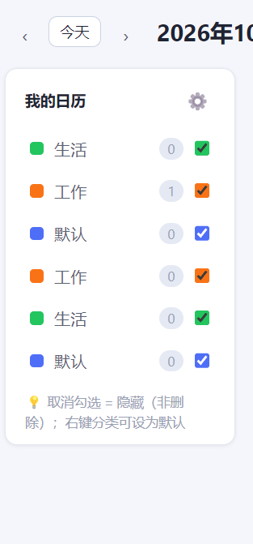
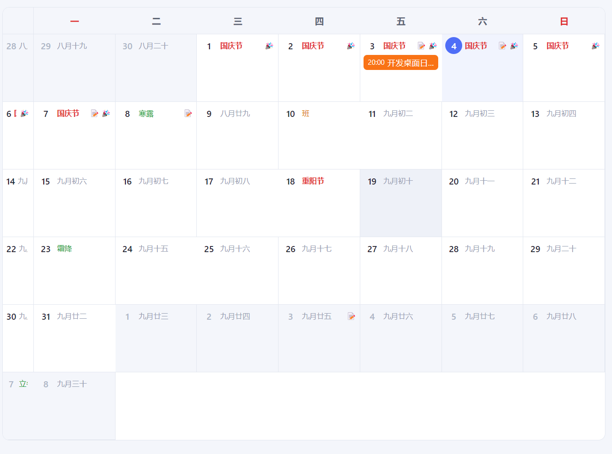
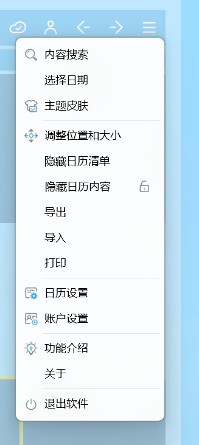

# 问题清单 
我把桌面端分为三个可操作的部分：背景桌面日历、主页面、托盘；
我把我在实际使用中遇到的bug告诉你，你要进行调试修改，保证这些问题不在复现
首先：
### 主页面bug
* 双击托盘图标应该是打开主页面，而不是开关🔒
#### 概览页面
#### 日历页面
* 双击日期单元格才进入事件编辑页面，而不是单击
* 这个页面出现了两个默认，删除一个
* 设为默认标签之后，应该要可以取消默认，现在没有这样的操作可以取消
* 这个月视图日期都是错误的，把日期改正过来，单元格的显示，周六周日的显示参照桌面日历部分
* 最右边的日期显示不要了，把右边部分的按钮右移

#### 任务页面
* 新建的任务点击之后会使真个主页面进入白屏，什么都不能再操作，重新设计任务的详情页面，点击之后在右侧弹出详情页面
* 任务列表中的任务可以直接拖动，拖到左侧的分组和清单上面即可进行归类
* 在分组新建的任务却没有在具体的分组展示，而是在全部任务中展示的，这个问题要彻底解决
* 分组是由很多个清单组成的列表， 那么新建了分组之后应该可以进行管理，增加删除清单，并且可以对清单进行拖动，直接拖到具体的分组中

#### 日记与笔记
* 将笔记与日记合并，统称为笔记，页面也只设计一个
* 笔记页面有很多问题，重新设计这个页面，设计三种不同的风格来供我选择
* 笔记列表也有很多bug，写了一篇笔记，左侧的列表会出现很多相同的

#### 专注助手
* 开始专注页应该设置一个开始按钮，而不是点进来直接开始计时专注
* 有了番茄钟之后，应该取消倒计时，番茄钟钟设置可以自定义专注时长，休息时长，到时间了进行提醒
#### 设置
* 删除所有的快捷键，不需要快捷键
* 专注时长的设置不要放下设置页面中，而应该放在专注助手里面

### 首先是背景桌面日历的问题
* 每次调整完的设置进行记忆，即使重启软件也和上次关闭时的状态一致
* 关于农历的显示，如果是某月初一只显示该月，比如八月初一，那么就显示为八月，其他日期只显示日即可，比如廿九；
* 节日的显示也和阳历农历放在同一行，如果显示位置不够，只显示前几个字皆可；
* 这里的专注时间不应该是0秒，有bug

* 当有🔓变为🔒状态的时候，背景桌面日历立刻进入到最底层窗口，之前处于它后面的窗口浮动上来；
* 菜单栏和左右按钮都收🔒的制约，处于锁定状态的时候，点击无效，只有处于🔓状态的时候才能点击；

* 桌面日历只显示本月的日期单元格皆可；
* 这个星期部分要矮一点，稍微比文字高一点就行，不要和日期单元格占用相同的高度；
*  菜单页面吧这个按钮删除，菜单栏里不需要做这个功能了；
*  把🔒放在左右端，菜单栏放在🔒的左边，菜单栏的左边放两个箭头按钮，分别表示调到上个月和下个月

*  关于背景桌面日历的显示效果，可以将整个界面的背景和每日单元格的显示使用不同的颜色区分，别都使用白色，这种显示效果并不是很好，设计3种好看的样例例来供我选择
*  农历和阳历放在同一行，同时如果周末补班需要标注班字样，如果是工作日放假需要标注休字样；
*  把菜单页面的调节位置和大小功能拿掉，这个没有用了；
*  周六周日两列用稍微不同的颜色标注一下，稍微醒目一点

*  还是解锁和锁定的bug：点击🔒进行解锁之后，再点击🔓进行锁定就没有反应了，这个问题没有解决掉；
*  可调节菜单选项不要放置在顶端一条，以图片中的形式三个横杠作为一个按钮，点击之后进入菜单选项，可以调节位置和大小，可以调节背景透明度，可以选择隐藏背景桌面日历，可以选择不显示节假日等选项